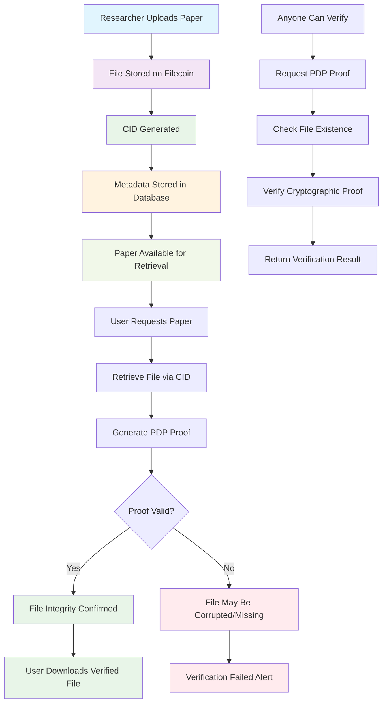

# Proof-of-Data-Possession (PDP) Flow Diagram

## PDP Verification Process

1. **Upload Phase**: Researcher uploads paper to Filecoin network
2. **Storage Phase**: File is distributed across multiple nodes with CID generated
3. **Retrieval Phase**: Users can download files using the CID
4. **Verification Phase**: Anyone can verify file integrity without downloading the entire file
5. **Proof Generation**: Cryptographic proofs ensure data hasn't been tampered with
6. **Global Verification**: Decentralized verification ensures transparency and trust

## Key Benefits

- **Tamper-Proof**: Cryptographic proofs prevent data modification
- **Efficient**: Verification without full file download
- **Decentralized**: No single point of failure
- **Transparent**: Anyone can verify file integrity
- **Permanent**: Files stored permanently on Filecoin network
